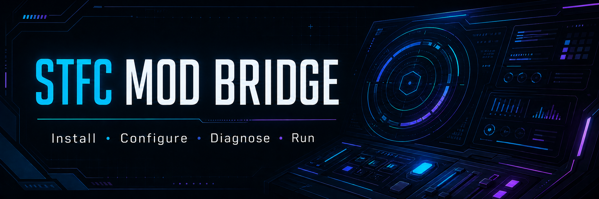
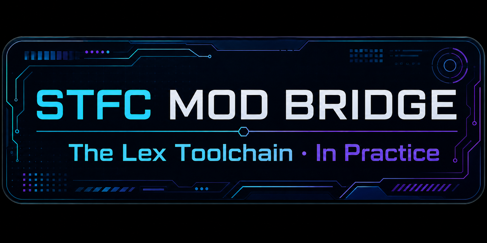

# STFC Mod Bridge



**Install · Configure · Diagnose · Run**

> [!WARNING]
> STFC Mod Bridge is pre-release software. The current test build is
> [`v0.1.0-rc.4`](https://github.com/Guffawaffle/stfc-mod-bridge/releases/tag/v0.1.0-rc.4),
> published as a **Public canary — qualification is still in progress**. Read
> its permanent release notes and open checks before installing. `v0.1.0-rc.3`
> is rejected because of a provider-state projection regression.

STFC Mod Bridge is a source-neutral Windows application for installing,
updating, repairing, configuring, diagnosing, and running supported Star Trek
Fleet Command community-mod distributions.

Mod Bridge is a .NET 8 WPF application for Windows x64. It discovers and
validates an STFC installation, opens the Scopely launcher, manages verified
mod artifacts transactionally, edits configuration through staged Save/Discard
sessions, and provides a destination-oriented Data Sync workspace.

## Repository boundary

This repository owns the Windows application and its release lifecycle. It
does **not** own the C++ mod runtime or the macOS launcher. A mod distribution
supplies versioned provider data—release location, runtime manifest,
configuration schema, capabilities, trust rules, and migration metadata—rather
than requiring a distribution-specific launcher build.

Bundled Guffawaffle and NetniV packs coexist in one build. Capabilities without
published evidence remain visibly unknown and their dependent operations fail
closed; Mod Bridge never infers support from a provider's display name.

## Test a pre-release

The current build is a public canary for technically comfortable testers, not a
stable or general release. Read the [pre-release testing guide](TESTING.md)
before changing an installed mod. MSIX-era releases use
`STFCModBridge.appinstaller` as the installation entry point. Windows verifies
the signed MSIX, owns update and uninstall, and installs the read-only program
payload under WindowsApps. The ZIP, manifest, SBOM, and attestation bundle are
machine-consumed release inputs or a clearly labeled standalone fallback.

Preferences, journals, rollback data, and configuration backups live under
`%LOCALAPPDATA%\STFC Mod Bridge`. Windows Installed Apps and Settings → About
provide application management and uninstall access. Uninstall preserves that
external local data and never removes the Community Mod DLL or TOML from the
game.

Use the [bug report](https://github.com/Guffawaffle/stfc-mod-bridge/issues/new?template=bug-report.yml)
or [usability feedback](https://github.com/Guffawaffle/stfc-mod-bridge/issues/new?template=usability-feedback.yml)
form for ordinary feedback. Report security vulnerabilities privately as
described in [SECURITY.md](SECURITY.md).

## Projects

- `STFCCommunityMod.Launcher` — WPF application.
- `STFCCommunityMod.Launcher.Updater` — replace-on-exit update helper.
- `STFCCommunityMod.Launcher.Core` — UI-independent contracts and services.
- test projects under `tests/` — deterministic unit and WPF projection tests.
- `STFCCommunityMod.Launcher.LocalGameIntegration.Tests` — the explicitly
  opted-in real-install certification harness; its initial Inspect profile is
  read-only and later mutation/launch profiles remain separately gated.

## Build and test

```powershell
dotnet restore STFCCommunityMod.Launcher.sln --locked-mode
dotnet test STFCCommunityMod.Launcher.sln -c Release --no-restore
```

Double-click `run-launcher.cmd` to build and start the exact Release executable
from this checkout. A failed build remains visible and never launches stale
output.

`scripts/smoke-settings.ps1` is an interactive UI Automation gate: it launches
and focuses Mod Bridge to exercise keyboard behavior. Local runs must opt in
with `-AllowInteractiveFocus`; ordinary tests and LexRunner branch gates remain
headless. GitHub Actions may run the smoke on its isolated desktop.

`scripts/test-local-game-install.ps1` runs the implemented read-only Inspect
profile only for an explicitly supplied game directory. See the broader
[local integration contract](docs/windows-launcher/LOCAL_GAME_INTEGRATION.md).

## Package

```powershell
./scripts/publish.ps1
```

Package output is written under `artifacts/win-x64`. The `.appinstaller`
descriptor is the user-facing install artifact. Its signed MSIX is hosted at an
immutable versioned URL; the ZIP remains a signed standalone/self-update
fallback.

## Architecture and provenance

- [Repository extraction provenance](docs/EXTRACTION_PROVENANCE.md)
- [Provider-pack boundary](docs/PROVIDER_PACKS.md)
- [Product contract](docs/windows-launcher/CONTRACT.md)
- [UX direction](docs/windows-launcher/UX_DIRECTION.md)
- [Data Sync capability matrix](docs/windows-launcher/data-sync-capabilities.md)
- [Signing policy](docs/windows-launcher/CODE_SIGNING.md)
- [Release security operations](docs/windows-launcher/RELEASE_SECURITY_OPERATIONS.md)
- [Google Cloud update hosting](docs/windows-launcher/GCP_UPDATE_HOSTING.md)
- [Closed-alpha testing guide](TESTING.md)
- [Security policy](SECURITY.md)
- [Product identity inventory](docs/windows-launcher/PRODUCT_IDENTITY.md)
- [About, attribution, and notice ownership](docs/windows-launcher/ABOUT.md)
- [Generated third-party notices](THIRD-PARTY-NOTICES.md)

## Portfolio provenance



STFC Mod Bridge is LexRunner Portfolio Project 001 under the SmarterGPT brand.
During the active v1 lifecycle, its evidence label is **The Lex Toolchain · In
Practice**. The completed-state label **Proven in Practice** is reserved for an
evidence-backed release.
