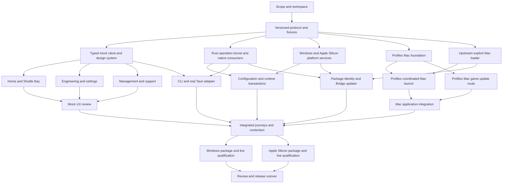

# Rust Bridge implementation plan

This plan replaces the Bridge application with a Rust backend and a replaceable web frontend. The first release targets Windows x64 and Apple Silicon macOS together. The main product goal is to make interface design, testing and iteration easy: the entire UI must run against typed mocks before it needs the game, native libraries or a compiled Rust backend.

Intel Mac host support is excluded by user direction. The user's expectation that the game will deprecate Intel support is not treated as a verified product announcement. On Apple Silicon, the selected game process still determines the architecture of injected runtime code. An arm64 Bridge shell cannot establish compatibility with a game running under translation.

The plan contains 30 work packages and 68 dependency edges. The initial 2026-10-03 validation used LexRunner 2.1.0 and produced 10 dependency levels. Planning validation establishes scheduling structure and runs no implementation gates. The initial inventory and zero-execution counters retained below describe plan construction, not current implementation status; current acceptance comes from separately bound execution receipts.

## Implementation refinement, 2026-10-05

We are continuing our Bridge. Named profiles use canonical Profiles runtime isolation under the current OS user; routine launches do not require a separate OS account or stored OS-account credentials. Native consent for importing another user's saved setup remains a separate flow.

A static study of the maintainer's Windows x64 launcher v0.4.2 supplied five implementation ideas. The MSI SHA-256 is `b2f125ce2cba6120110de834fd6ad35276a8b6e6f3ed024fb3b4d6337850544c`; the extracted executable is `57eac414d43766ceea9f822fd8dd0151a6ecf73c31a46ad07e5a32a20ea7aa32`. We read the embedded frontend and native messages without executing the installer, application or foreign JavaScript. These observations do not qualify its native transactions or Mac build. The user reports an Apple Silicon build exists; our own platform qualification remains independent.

| Refinement | Existing package owners | Required behavior |
| --- | --- | --- |
| Completion-based update observation | 22, 24, 26 | One scheduler per host; shared manual/automatic in-flight checks, configurable/disabled cadence, per-family timeouts, backoff, outcome and observation age. Concrete family ports join at integration. Offline local launch stays usable. |
| Latest-read reconciliation | 20, 26 | Late results, errors and loading-state completion cannot replace newer support reads or targets. Abandoned reads do not cancel admitted operations. |
| Structured diagnostics | 20, 22 | Bounded records with time, severity, component, operation correlation, phase and reason code; opt-in debug detail and exact allowlisted preview/export. Logs are separate from the recovery journal. |
| Fork/development feeds | 15, 23, 24 | Explicit configurable feeds without rebuilding, while retaining stable provider/application authority and captured transaction identity. Preferences do not silently switch installed sources or keys. |
| Official Bridge updater evaluation | 23, 24 | Evaluate the [Tauri updater](https://v2.tauri.app/plugin/updater/) behind the desktop port. Keep engine policy independent and record a safe durable handoff before an installer can exit the host. |

These are acceptance refinements within existing future packages. They add no packages or dependency edges and do not reopen completed foundation criteria. They preserve the three trust domains, canonical Profiles game updating, exact native pairing and independent platform signing. Tauri updater support is an implementation candidate, not a release acceptance result. Checksum/staging/atomic-replacement messages reinforce existing transaction requirements without proving the other launcher's guarantees.

The next implementation remains retained capture-to-worker custody, followed by configuration completion and canonical native writer integration. The plan does not create another game updater or add UI styling/profile-system work from the other launcher.

## Architecture and ownership

Rust owns the application engine, operation custody and domain policy. A versioned command, query and event contract connects every client to that engine. The proposed frontend is Svelte, TypeScript and Vite, with Tauri as a thin desktop adapter. The framework remains replaceable because screens depend on the generated client contract and shared frontend context.

Tauri supports frontend frameworks and recommends Vite for SPA development. This supports the proposed development arrangement, while backend independence is an architectural requirement enforced through the Rust dependency graph and headless workflow tests. See [Tauri frontend configuration](https://v2.tauri.app/start/frontend/).

| Component | Responsibility | Boundary |
| --- | --- | --- |
| `bridge-contracts` | Versioned DTOs, errors, target selectors, revisions, fixtures and generated TypeScript | No presentation styling or window types |
| `bridge-domain` | Pure capabilities and decisions | No filesystem, native process or UI dependency |
| `bridge-engine` | Commands, captured operations, transactions, events and recovery | No Tauri, DOM or webview dependency |
| `bridge-profiles` and `bridge-toml` | Safe consumers of canonical native APIs | No duplicate catalog, account store or game updater |
| Platform crates | Windows and macOS physical identity and native services | Each platform supplies its own verified semantics |
| CLI and Tauri adapters | Invoke the same dispatcher and expose the same results | Thin clients, independently testable |
| Frontend | Reusable components, navigation, drafts and player feedback | Real and mock transports use identical contracts |

For the proposed first release, each CLI or Tauri process hosts the engine in process. Normal exit waits until admitted work reaches a safe durable state. Closing a window or disconnecting a client cannot drop a writing worker's lease. Forced process termination leaves a journal for recovery by the next host. A separately supervised daemon would require its own decision and qualification.

Repository ownership stays explicit:

| Repo | Canonical Windows checkout | Planned work |
| --- | --- | --- |
| Bridge | `D:/dev/stfc-mod-launcher` | 26 packages: Rust application, frontend, native consumers, delivery and qualification |
| Profiles | `D:/dev/stfc-profiles` | 3 packages: macOS catalog/setup, coordinated launch and game update route |
| Upstream | `D:/dev/netniv/stfc-mod` | 1 package: explicit macOS loader and producer integration |
| Downstream | `D:/dev/stfc-mod` | Reference only; no implementation assigned by this plan |

These Windows paths establish local ownership. Actual Mac execution requires native-host checkout bindings. Existing mod/runtime producers remain authoritative. Profiles retains catalog, storage, lifetime exclusions, reusable integration hooks and game updating. The new Bridge scope must amend its current Windows/WPF agreement without moving the existing macOS loader or runtime here.

## Dependency milestones



The diagram groups related packages. The JSON graph is authoritative for individual dependencies and also includes the Windows session slice, capability projections and support engine.

| Milestone | Exit condition | Packages |
| --- | --- | --- |
| M0 Scope and contract | New ownership agreement, reproducible workspace, versioned wire contract and fixtures | 00, 01, 02 |
| M1 Mock frontend | Complete first-release journeys are usable and reviewed without Rust, game or native modules | 03, 12, 18, 19, 20, 25 |
| M2 Headless engine and native prerequisites | Operation kernel, native consumers, both platform adapters, configuration and session/game commands pass their declared checks | 04–11, 13–17, 21, 22 |
| M3 Packaged integration | Paired packages, independent Bridge update and real UI/CLI parity pass contention and recovery checks | 23, 24, 26 |
| M4 Both platform releases | Exact installed Windows and Apple Silicon packages pass live journeys and accessibility; independent review completes cutover | 27, 29, 30 |

Milestones overlap. M1 does not wait for M2. Package 28 was removed when Intel host qualification left scope; the remaining IDs stay stable.

## Work package dependency table

Every package has detailed deliverables, acceptance criteria, owning repo, write scopes, native host requirements and planned gate commands in [work-packages.json](D:/dev/stfc-mod-launcher/docs/plans/rust-tauri-cross-platform/work-packages.json). IDs below use the `br-` prefix in the machine-readable plans.

| ID | Work | Owner | Requires |
| --- | --- | --- | --- |
| 00 | Scope, ownership and qualification dispatcher | Bridge | — |
| 01 | Rust/frontend workspace, pins and CI definitions | Bridge | 00 |
| 02 | Versioned protocol, ports and scenario fixtures | Bridge | 01 |
| 03 | Typed frontend client and deterministic mocks | Bridge | 02 |
| 04 | Operation ownership, journals and recovery | Bridge | 02 |
| 05 | Safe Profiles/TOML consumers and native ABI evidence | Bridge | 02 |
| 06 | Windows platform services | Bridge | 02 |
| 07 | Apple Silicon macOS platform services | Bridge | 02 |
| 08 | Mac catalog, ordinary setup and protected-state foundation | Profiles | 02 |
| 09 | Explicit Mac loader, producer hooks and artifact contract | Upstream | 02 |
| 10 | Coordinated Mac launch and lifetime qualification | Profiles | 08, 09 |
| 11 | Mac game update route and recovery | Profiles | 08 |
| 12 | Design system and shared frontend composition | Bridge | 03 |
| 13 | Capability and observation projections | Bridge | 02 |
| 14 | Configuration/Data Sync drafts and transactions | Bridge | 04, 05 |
| 15 | Runtime install/source switch and recovery | Bridge | 04, 06, 07, 14 |
| 16 | Windows session/game application slice | Bridge | 04, 05, 06 |
| 17 | Mac session/game application slice | Bridge | 04, 05, 07, 10, 11 |
| 18 | Home/Shuttle Bay and navigation against mocks | Bridge | 12 |
| 19 | Engineering/settings against mocks | Bridge | 12 |
| 20 | Management/support against mocks | Bridge | 12 |
| 21 | CLI/AXF and real Tauri transport | Bridge | 03, 04, 13 |
| 22 | Diagnostics, history and support engine | Bridge | 04, 13, 14 |
| 23 | Package identity, native pairing and signing pipeline | Bridge | 01, 05, 06, 07, 09 |
| 24 | Independent Bridge self-update and recovery | Bridge | 04, 06, 07, 23 |
| 25 | Independent mock UX review and correction | Bridge | 18, 19, 20 |
| 26 | Integrated journeys and multi-client contention | Bridge | 14–22, 24, 25 |
| 27 | Windows packaged UI and live qualification | Bridge | 23, 25, 26 |
| 29 | Apple Silicon packaged UI and live qualification | Bridge | 23, 25, 26 |
| 30 | Final review, release readiness and WPF retirement | Bridge | 27, 29 |

Configuration precedes source switching because source switching must coordinate the actual draft transaction participant. Real frontend binding follows reviewed mocks. The Mac application slice cannot complete until both native launch and the game update route are qualified.

## Parallel work and integration ownership

Use one root integrator and at most three active workers. Assign packages by dependency readiness, available host and disjoint write scope. Reassign workers as packages finish; permanent frontend/backend/platform agent assignments would waste capacity when a dependency or host blocks a lane.

The first parallel wave after the contract should prioritize the mock client, operation kernel and uncertain Mac foundation/producer research. Once shared frontend composition is ready, three workers can independently build Home, Engineering and Management. Another wave can split operation/native integration, Windows services and Apple Silicon work. Root chooses the wave from the ready queue and remaining risk; the plan does not promise that every ready item runs together.

Root owns Cargo/workspace manifests and lockfiles, Rust module registration, frontend dependency files, top-level app/state/routes, generated contract registration, fixture indexes, qualification dispatcher registration and CI composition. Workers send integration requests for these surfaces. Contract updates have one owner and regenerate both clients and fixtures together.

Profiles packages 10 and 11 share native composition, catalog/installation/tests and the qualification dispatcher. They may be dependency-ready together, but they cannot edit those shared resources concurrently. Bridge Windows/Mac session packages similarly share composition and need a single writer. Frontend screens consume the frozen shared context; integration package 26 later holds the frontend composition resource when selecting real transport.

Use independent reviews for protocol/engine custody, native platforms and UX. The planning review already added missing configuration, mock-client and UX dependencies, corrected native source scopes, and required multi-suite gate aggregation. Product implementation reviews still follow each owning repo's review workflow.

## Native prerequisites and release blockers

The first implementation steps can establish workspace and mocks while native executor bindings are being resolved. A missing Mac host blocks native proof; it does not need to block browser UI development.

| Prerequisite | Present evidence | Required resolution |
| --- | --- | --- |
| Apple Silicon executor | No Mac executor attached to this session | Bind native CI and a live Apple Silicon qualification host, checkout roots and exact input artifacts |
| Profiles Mac foundation | Current source returns platform-unavailable for required registration/ordinary setup | Package 08 implements and tests identity, custody, protected state and companions |
| Profiles Mac launch | Current coordinated route is launch-unqualified | Packages 09 and 10 qualify explicit loading, isolated stores, callbacks and lifetime ownership |
| Profiles Mac game management | Current shared updater route is unsupported | Package 11 researches official payloads and implements direct update or a qualified managed handoff |
| Package identity | Existing product uses Windows MSIX conventions | Package 23 records Windows migration, macOS identity, publishers, signing/notarization and updater channels |
| Execution binding | No issues, execution branches or gate implementations created | Materialize each package in its owning repo, with exact inputs and native-host commands |

A direct Mac game updater is not assumed feasible. A managed official-updater handoff is acceptable only when its observation, exclusion, completion and recovery limits are explicit. Changing the route cannot silently weaken a required journey.

Native arm64 Bridge requires matching in-process Profiles/TOML binaries. Injected mod code matches the actual game process. If the game requires x86_64 under Rosetta on Apple Silicon, qualify that exact loader/runtime/companion route on Apple Silicon. No Intel hardware or universal Bridge package is required.

Current source pins are observations, not qualification of future Mac binaries: Profiles revision `aeef4861693613fab119edcd03117b4e8de01d4b`, shared TOML revision `f83c8d55b542cb4b8ac4a85ca5d69173c0cd58b0`, xmake `3.0.8`. Native changes require new immutable source/build receipts and consumer pins before dependent integration acceptance.

## Acceptance and evidence

Prepared plans bind the exact installation/profile/session, document revisions, schema and artifact identity. Commit rechecks those identities under the retained exclusion. A losing writer must return busy before it creates downloads, staging, backups or journals. Retrying a commit after response loss returns the original operation; conflicting reuse of its idempotency key rejects.

Drafts use Save/Discard/Stay across all views. Unknown TOML keys/comments survive. External replacement or revision changes preserve the draft and reject commit. Read-only support queries do not create stores or launch services. Runtime deployment, official game updates and Bridge self-updates retain separate trust authorities.

Each package's acceptance dispatcher must run every declared suite and collect each required native-host receipt. Missing commands, hosts or evidence are blocked outcomes. The Runner projection's `BRIDGE_REQUIRED_SUITES` is the complete suite inventory; one passing suite cannot accept a multi-suite package. Commands under `scripts/next` and the new native qualification scripts are future deliverables, not existing passing checks.

Each implementation receipt must bind repo and exact source head/diff, command/arguments/cwd, host OS/architecture/toolchain, dependency hashes, artifact hashes, outputs and outcome. Runtime receipts additionally bind installation physical identity, immutable profile ID or explicit ordinary mode, client version, actual PID/start/executable and loaded module observations. Account sign-in is a separate observed outcome. Reuse evidence only where its inputs remain valid.

Browser/mock tests qualify the frontend contract and usability. Native Windows WebView2 and macOS WKWebView need their own installed-package evidence, including Narrator/VoiceOver, keyboard focus, scaling and real journeys. Current Tauri documentation supports embedded WebdriverIO automation on macOS; direct `tauri-driver` alone does not. Any selected test-only embedded server or IPC mocking plugin must be absent from shipped packages, which also receive independent smoke and UX checks. See [Tauri WebDriver documentation](https://v2.tauri.app/develop/tests/webdriver/).

## LexRunner artifacts and use

The canonical plan lives in this documentation folder so it can be reviewed and versioned. Existing `.smartergpt` plans and legacy .NET gate configuration were not replaced. Always pass this plan explicitly.

- [Feature Spec v0](D:/dev/stfc-mod-launcher/docs/plans/rust-tauri-cross-platform/feature-spec.json) describes the intended product.
- [Work packages](D:/dev/stfc-mod-launcher/docs/plans/rust-tauri-cross-platform/work-packages.json) own the detailed dependency/scopes/gates contract.
- [Expanded Execution Plan v1](D:/dev/stfc-mod-launcher/docs/plans/rust-tauri-cross-platform/runner/execution-plan.json) represents all 30 packages.
- [Runner scheduling projection](D:/dev/stfc-mod-launcher/docs/plans/rust-tauri-cross-platform/runner/plan.json) is schema-valid planning input.
- [LexRunner generated seed](D:/dev/stfc-mod-launcher/docs/plans/rust-tauri-cross-platform/runner/generated-seed.json) is its generic three-issue dry-run output; the expanded plan adds the actual engineering dependencies.
- [Dependency order](D:/dev/stfc-mod-launcher/docs/plans/rust-tauri-cross-platform/runner/dependency-order.json), [dry-run output](D:/dev/stfc-mod-launcher/docs/plans/rust-tauri-cross-platform/runner/dry-run.json) and [verification receipt](D:/dev/stfc-mod-launcher/docs/plans/rust-tauri-cross-platform/runner/verification.json) retain the planning evidence.

Run from `D:/dev/stfc-mod-launcher`:

```powershell
node docs/plans/rust-tauri-cross-platform/verify-plan.mjs
lexrunner --no-emit-frames schema validate docs/plans/rust-tauri-cross-platform/runner/plan.json --json
lexrunner --no-emit-frames weave merge-order docs/plans/rust-tauri-cross-platform/runner/plan.json --json
lexrunner --no-emit-frames --token-budget 6000 gate run docs/plans/rust-tauri-cross-platform/runner/plan.json --dry-run --keep-cache --json
```

The dry-run initially hit LexRunner's default 5,000-token input-size allowance: this JSON was estimated at 5,392 tokens. An explicit 6,000-token input allowance permits structural validation. It does not execute a gate or change mutation permissions.

Do not execute this cross-repo scheduling projection as a bulk gate or merge command. Before execution, create repo-scoped issue/work packets, bind exact source inputs and native-host roots, implement real qualification commands, and materialize the appropriate owner/host plans. `target: main` names the eventual Bridge destination; it selects no implementation branch and grants no merge eligibility. New branches/worktrees still require the workspace's authorization and issue rules.

Runner coordination uses explicit `databasePath: D:/dev/stfc-workspace/.smartergpt/runner/coordination.db`. Destructive mutations and automatic Lex frame emission remain disabled. Continuity belongs to Bridge's scoped `docs/architecture` and `workspace/tooling` modules. Shadow LexSona constraints were read for planning; there is no Run application or observed implementation outcome.

The original 2026-10-03 implementation order began with package 00, followed by workspace foundation 01 and protocol/fixtures 02. UI mocks, the operation kernel and native prerequisite work then became independent within the concurrency and ownership rules above. The dated refinement near the top records the current next work.
