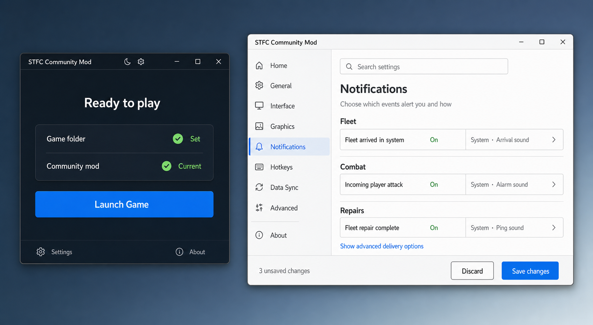

# Windows Launcher UX Direction

Status: accepted product direction

Date: 2026-07-27

Applies to: `WL-002`, `WL-006`, `WL-008`, and `WL-010`

## Decision

The production launcher uses a modern, compact Windows application shell with
light and dark themes. LCARS is no longer a product requirement.

The home surface follows the focused-launcher and compact-utility concepts:

- show whether the player can act;
- show only the small number of states that affect that action;
- offer one contextual primary action;
- move configuration, product metadata, and diagnostics behind explicit
  navigation.

The settings surface is a separate, larger workspace inside the same
application. It may use denser navigation because configuration is an
intentional task. This distinction prevents the extensive TOML schema,
especially notifications and hotkeys, from turning the launcher home into a
developer dashboard.



The image is a directional reference, not a pixel contract. Product behavior,
accessibility, native Windows conventions, and the generated configuration
schema take precedence over exact spacing, icons, colors, or copy in the
mockup.

## Complexity reference

The public [community configuration tool](https://modconfig.pages.dev/) was
reviewed as a complexity reference, not as a visual template. Its shipped
definitions currently describe roughly 159 controls, including about 90
shortcuts, 20 sync settings, 17 graphics settings, 14 support-level patch
toggles, and 13 interface settings.

That snapshot does not include the full notification system planned for this
fork and is not an authoritative launcher schema. It demonstrates why a flat
form, permanent output panel, or single row of top-level tabs will not scale.

## Why the WL-002 preview feels clunky

The WL-002 shell renders the launcher's internal discovery and health model
directly. That was useful while proving bounded discovery, path validation,
process safety, and composable health, but it exposes implementation concepts
that most players cannot act on:

- candidate counts and provenance;
- process-boundary explanations;
- per-user storage ownership;
- every health dimension at once;
- long diagnostic descriptions.

Those facts remain valuable to support and development. They belong in
structured logs and an explicit diagnostic view, not on the normal launcher
surface.

## Product principles

### Outcome first

The first screen answers:

1. Is the game installation usable?
2. Is the community mod usable and current?
3. What is the next safe action?

It does not explain the discovery algorithm unless the user asks for
diagnostics.

### Progressive disclosure

Common actions remain visible. Technical detail appears only when it changes
the user's decision or when the user opens Settings, About, or Diagnostics.

### Privacy by default

Normal UI never renders game, profile, launcher-storage, or candidate paths.
Paths remain available internally for validation and may be included in an
explicit diagnostic export only after the user opts in.

### Schema-driven configuration

The launcher does not maintain a second handwritten list of TOML settings.
Categories, controls, defaults, constraints, platform support, deprecations,
restart behavior, descriptions, and search terms come from the shared,
versioned configuration schema defined by `WL-005`.

### Sparse user intent

The editor writes explicit user choices rather than materializing every
runtime default. Removing an override is a first-class action.

## Application shell

### Adaptive window density

The launcher has two presentation modes:

- **Home:** compact, centered, and action-oriented.
- **Workspace:** wider and navigable for Settings, Diagnostics, and other
  deliberate management tasks.

Moving between them may resize or reflow the same window. It must not open
multiple competing launcher windows.

### Integrated window chrome

The application name appears once in an integrated draggable title area. The
Home does not repeat a native window title, product heading, and platform
subtitle.

The integrated chrome retains ordinary Windows behavior:

- accessible minimize, maximize/restore, and close controls;
- resize borders, title-area dragging, and double-click maximize;
- system commands and keyboard shortcuts;
- edge snapping and the Windows `Win+Z` Snap Layout shortcut.

Caption controls use centered vector geometry rather than font glyphs. The
application still exposes its full product title to Windows, assistive
technology, and the task switcher.

Returning `HTMAXBUTTON` from custom WPF chrome caused Windows to draw native
caption visuals over the launcher's control and is not used. Hover-triggered
Snap Layouts may be reconsidered only if they can be enabled without mixed
native/custom rendering.

### Application identity assets

The production launcher uses the existing community-mod artwork in
`assets/launcher.png` and `assets/launcher.icns`. The Windows asset pipeline
produces a multi-resolution `.ico` from that approved source and applies it
consistently to:

- the executable and taskbar;
- the window and task switcher;
- shortcuts and installer/update surfaces;
- About and release-facing launcher artwork where appropriate.

The launcher does not invent substitute release artwork. The final asset must
remain legible at small Windows icon sizes and in both light and dark shell
contexts.

Home reuses the canonical `assets/portfolio/stfc-mod-bridge-banner.png`
directly as a linked WPF resource. Its opaque dark substrate preserves the
artwork's own contrast in Light, Dark, System, and Windows high-contrast
contexts; the adjacent status and action surfaces remain ordinary themed text
and controls, so the image is never the sole carrier of operational state.
The artwork is non-interactive and does not enter keyboard focus order. UI
Automation receives one concise `STFC Mod Bridge` image name and no decorative
child descriptions, while the title-area product text remains the ordinary
accessible product-name equivalent.

### Theme

The theme preference is:

1. System default;
2. Light override;
3. Dark override.

The integrated title area exposes this preference as an accessible dropdown.
Its closed state shows the selected preference, not an ambiguous action:
`System`, `Light`, or `Dark`. The open menu marks the current selection and
supports ordinary keyboard navigation. When `System` is selected, supplemental
help may also name the currently resolved Windows mode without changing the
stored preference.

Light and dark themes preserve the same hierarchy and semantics. Green is
reserved for healthy state, amber for warning, red for action-required or
failure state, and the primary action color remains distinct from health
colors.

Theme, motion, and scale preferences are launcher-owned state. They do not
modify the mod TOML.

Color mode and visual style remain separate internal axes. A future visual
style selector could offer the standard Fluent presentation and an optional
LCARS presentation, while each style still respects System, Light, or Dark
where it supports them. LCARS is not a committed production style and must not
enter the color-mode enum as a special-case theme value. Any added style must
cover the complete shell, settings adapters, dialogs, accessibility states,
high-DPI behavior, and release assets before it can ship.

## Home surface

The healthy home contains:

- application name;
- theme and settings access;
- stable product copy that does not repeat row-level health;
- a game-installation row;
- a community-mod row;
- one contextual primary action;

Example healthy rows:

```text
Game folder       [success icon]       Change
Community mod     [success icon] Current
```

The game row offers a quiet `Change` action when appropriate. It does not show
the selected path. A successful game-folder row does not repeat `Set` beside a
success icon; its accessible name still announces `Game folder set`.

The default Home copy is:

```text
Make STFC yours.
Install, update, and configure the community mod in one place.
```

Row-level state remains in its row. Product copy is replaced only when a
blocking or operation-wide condition materially changes the user's next safe
action.

The primary action changes with the resolved product state:

| State | Headline | Primary action |
|---|---|---|
| Game missing or selection invalid | Game folder needed | Set game folder |
| Game ready, mod missing | Ready to install | Install mod |
| Mod update available | Update available | Update mod |
| Game and mod healthy | Ready to play | Launch game |
| Repair required | Needs attention | Repair |
| Game running | Game is running | Bring game forward or disabled launch |
| Operation active | Working | Progress/cancel when safe |
| Offline but locally healthy | Ready offline | Launch game |

### Future-state Game client row

The accepted post-v1 direction is for the launcher to replace the official
launcher during routine play. `Game client` therefore evolves from a status
row into the home for base-game operations:

```text
Game client          Ready                  Launch game
Game client          Update available       Update   Launch game
Game client          Updating               Progress
Game client          Running                Bring forward
```

`Launch game` remains visible whenever launch is safe. `Update` appears only
when a base-game update is known to be available. If an update is mandatory or
the installed game/mod combination is incompatible, launch is disabled with an
actionable reason rather than silently attempted.

Game update, mod update, and launcher update are different product states.
Their labels, progress, error recovery, and diagnostics must never collapse
into an ambiguous generic `Update`.

This direction has macOS precedent, but Windows direct game updating remains a
separate post-v1 architecture and security gate. The first production release
continues to delegate base-game installation, authentication, updates, and
repair to the official launcher.

Detailed process safety, discovery provenance, artifact hashes, and internal
health dimensions are logged. The home shows them only when they change the
safe action.

## Status semantics

Success, warning, and failure use consistent vector icons with adjacent row
labels and explicit status text when the user must distinguish or act on the
state. Literal emoji are not the implementation contract because their
appearance varies by Windows font and assistive technology.

Every icon has:

- an adjacent row label plus visible status text when it adds information;
- a screen-reader name;
- meaning that does not depend on color;
- a deterministic action when user intervention is possible.

The game-client row uses semantic process states:

| State | Visual treatment | Visible text |
|---|---|---|
| Running | Filled green status light | `Running` |
| Not running | Hollow neutral status light | `Not running` |
| Checking | Blue progress indicator | `Checking…` |
| Unavailable | Amber warning icon | `Status unavailable` |

`Not running` is a normal inactive state and is never rendered as an error.
Process-state icons are indicators, not controls; play or launch glyphs are not
used because they imply a clickable launch action.
`Checking` and `Unavailable` appear only when the process service can
truthfully distinguish those states; the synchronous `WL-002` probe currently
resolves only `Running` and `Not running`.

The launcher uses an unprivileged Windows shell window-created signal to
identify a new `prime.exe` process and the tracked process's exit signal to
detect shutdown. It re-runs the authoritative process inspection only after a
transition and does not continuously poll or require WMI. Manual `Refresh
status` is a development affordance and is not part of the production Home.
Failure to establish reliable automatic monitoring is surfaced as launcher
health/diagnostic state rather than delegated to the player.

### Observable action feedback

An accepted action must never appear to be a no-op merely because its result
does not change the visible state. The shared interaction contract is tracked
in [#201](https://github.com/Guffawaffle/stfc-mod/issues/201).

The shared action contract must represent at least idle, working, completed
with changes, completed without changes, and failed or unavailable states. It
must define:

- the relationship between command state, button state, and operation state;
- visible and screen-reader feedback without relying on animation, color, or
  an icon alone;
- duplicate-activation, focus, cancellation, retry, and reduced-motion
  behavior;
- when feedback belongs in the button, affected status row, a non-modal
  confirmation, or a combination;
- how short synchronous checks and future long-running install, repair, update,
  and diagnostic operations share semantics without pretending they have the
  same progress capabilities.

Candidate treatments include operation copy, a compact progress glyph,
affected-row feedback, or a brief unchanged-state confirmation. None is
accepted globally yet; individual operations must not invent independent
feedback before the shared state and accessibility decision.

## Settings workspace

Settings is not a modal and is not constrained to the compact home dimensions.
It uses:

- category navigation;
- a global search field;
- a scrollable content region;
- a persistent changed-state/save area;
- a route back to Home.

Initial categories are:

1. General
2. Interface
3. Graphics
4. Notifications
5. Hotkeys
6. Data Sync
7. Advanced
8. About

Advanced contains experimental, developer, and support-directed controls. Patch
installation toggles do not appear in common categories.

### Launcher preferences and launch profiles

Launcher-owned preferences are distinct from the schema-driven mod settings.
The future General area may include:

- start the launcher with Windows, explicitly opt-in and default off;
- automatically check for launcher and mod updates;
- separate consent and policy for downloading or installing an update;
- release channel, theme, reduced motion, and close/minimize behavior;
- behavior after launching STFC, such as remaining open, minimizing, or
  closing.

Labels must distinguish `Start the launcher with Windows` from starting STFC.
Likewise, checking for an update is not permission to install it.

Named launch profiles are a separate future product concept. A profile may
select a mod configuration, launch mode, and supported launch-time behavior,
but profiles must reuse the shared configuration schema rather than copy its
definitions. The active profile must be visible before launch, and switching
profiles must never silently materialize defaults, duplicate secrets, or
rewrite unrelated TOML.

Profiles and launcher preferences require dedicated PM work before
implementation. `WL-006` supplies the schema-driven configuration foundation,
while `WL-007` supplies the launch handoff on which profile selection can
operate.

### Launcher and sidecar product family

The intended direction is for the Windows launcher and sidecar to become one
coherent product family. Launcher decisions should inform the sidecar where the
product context matches, including visual tokens, typography, accessible
interaction primitives, schema-driven configuration, installation/update
contracts, diagnostics privacy, signing, and release behavior.

The current working distinction is:

- the basic launcher owns launch, install, update, repair, configuration, and
  privacy-preserving diagnostics;
- the full sidecar adds the richer always-available and runtime-companion
  experience.

This is direction, not a selected architecture. Separate applications with
shared libraries, basic/full distributions, optional sidecar modules, and
eventual full convergence all remain viable. Repository boundaries, process
ownership, competing updater prevention, optional installation, migration,
startup/background behavior, signing, privileges, rollback, and existing-user
compatibility require ample product and architecture discussion.

[#202](https://github.com/Guffawaffle/stfc-mod/issues/202) owns that decision.
It does not authorize a sidecar redesign, expand the current launcher sprint,
or permit user-facing copy to describe convergence as committed.

### Setting rows

A normal setting is one borderless full-width row. A thin divider separates
rows, the complete row receives a subtle hover treatment, and the value
controls align in a stable right-hand column. Only inputs and actionable
buttons receive control borders. Cards remain available for meaningful groups,
summaries, warnings, and errors; they are not repeated around each setting or
around only the control half of a setting.

A normal setting row contains:

- friendly title;
- optional short consequence-oriented description;
- appropriate control;
- effective or explicit value state;
- changed-from-default state;
- reset/remove-override action;
- restart or next-launch indicator when required.

Recurring implementation copy such as raw `next-session`, `Decimal number`,
`Default: true`, and canonical event identifiers does not appear in the
primary reading path. Friendly metadata uses compact neutral tags such as
`Next launch`, `Experimental`, and `Modified`. Numeric controls use a
schema-backed unit or suffix where one exists and do not occupy more width
than their supported values require.

`Use default` is not persistent row prose. An untouched value has no reset
control; once an override exists, the row exposes a semantic restore-default
icon with an exact tooltip and automation name. Where inheritance makes
explicit `On` different from an effective default of `On`, the editor must
make that distinction visible through a tri-state control or a clear default
or modified state. It must never hide semantically meaningful inheritance
behind an ordinary two-state switch.

The canonical TOML key, provenance, deprecated aliases, exact default, value
type, and detailed validation may appear in an explicit technical area,
keyboard-accessible tooltip, accessibility help, or diagnostics. They remain
searchable but are not primary labels.

### Renderer presentation contract

Player copy and editor hints come from the generated presentation envelope
defined in [CONFIG_SCHEMA.md](CONFIG_SCHEMA.md), not from one-off XAML
exceptions. The envelope may supply a human label, optional help, group,
search terms, unit, apply timing, stability, and accessibility text. A curated
override may improve those fields only when its canonical schema path is
validated during generation.

Groups and families are separate presentation concepts. A group creates a
page landmark such as Camera or Fleet. An optional approved family composes
several independently persisted settings beneath one shared heading, with
member labels and compact spacing. Family membership is generated and
validated; the renderer does not guess it from similar names.

This allows technical runtime names such as `Fr Scale` or
`fleet_queue_add` to become player language such as `System backdrop scale`
and `Add fleet to queue` without forking the authoritative type, default, or
persistence contract.

### Semantic icons

The launcher standardizes on Microsoft Fluent System Icons through
`FluentIcons.Wpf`, behind an application-owned semantic `AppIcon` abstraction.
Views request meanings such as Search, Restore Default, Notification, Sound,
Add, Remove, Next Launch, Warning, Keyboard, and Sync; they do not request
package glyph names directly.

Regular monochrome 20-DIP icons are the ordinary command treatment. Filled
variants are limited to selected navigation or deliberately active state.
Icon buttons retain 36–44-DIP targets and always provide tooltip, automation
name, keyboard focus, and disabled-state semantics. The app uses one icon
family and does not decorate every setting title merely because a glyph
exists. A curated build-generated subset of the official SVG assets remains a
future dependency-reduction option, not a prerequisite for the renderer
weave.

### Search and filtering

Search covers friendly titles, descriptions, canonical keys, and deprecated
aliases. The workspace supports filters for:

- changed settings;
- enabled settings;
- settings needing attention;
- advanced settings.

The hotkey category also detects duplicate or conflicting bindings. Data Sync
uses a repeatable target editor rather than exposing flattened target keys.

The player-approved toolbar search toggle and its across-launch memory remain
the current shell contract. A permanently visible field is not required to
land the renderer weave. The toggle may reveal a real field and the filters
above once their state is available.

### Save behavior

Edits are staged until the user saves. A bottom action bar appears only while
changes are pending, reports their number, and offers `Discard` and
`Save changes`. The settings viewport gives it a dedicated layout row only for
as long as it is visible, so no setting is covered and no empty footer consumes
space during ordinary browsing.

The same dirty-state bar summarizes when the staged changes will take effect.
That summary is derived from the apply metadata of the complete staged set, not
hardcoded per category:

- `Applies immediately` when every staged setting can take effect immediately;
- `Applies next launch` when every staged setting shares that boundary;
- `Some changes require a relaunch` when the staged set has mixed timing;
- a stronger restart requirement when any staged setting explicitly requires
  one.

Mixed timing is never collapsed into a misleading single-setting label.
Supplemental details may enumerate the affected settings, but the timing
summary itself remains visible without hover.

Save follows the configuration contract:

1. preserve comments and unknown keys;
2. validate the staged document;
3. create a recoverable backup;
4. atomically replace the destination;
5. report when the game must restart or relaunch.

Unsupported syntax or values never trigger a destructive rewrite.

## Notification settings at scale

Notifications are a first-class settings category and are expected to exceed
the current community configurator's complexity.

### Information architecture

Events are grouped by meaningful domain, for example:

- Battle and incoming attacks
- Fleet movement and mining
- Repairs and docking
- Armada
- Events and tournaments
- Territory and takeover
- Economy and treasury
- Experimental or generic toasts

Meaningful canonical prefixes remain visible in names such as
`fleet_arrived_in_system`, `armada_created`, and `fleet_repair_complete`.
Ambiguous flattened labels such as `created` or `repair_complete` are not used.

### Event row

Each event is one compact, searchable row. The collapsed row shows:

- friendly event name;
- enabled/off state;
- concise delivery summary;
- changed or deprecated status when relevant.

Expanding the row exposes the complete event policy:

- system notification;
- audio notification;
- sound selection and preview when supported;
- catalog default and runtime path;
- reset/remove override;
- migration or validation warning.

The UI does not render every delivery control for every event simultaneously.
Grouped rows, search, filters, and per-event expansion keep the category
scannable.

### Canonical value model

The editor represents the accepted canonical forms:

```toml
event_name = false
event_name = true
event_name = { system = true, audio = true, sound = "alarm" }
```

- `false` disables the event.
- `true` enables system delivery only.
- An inline table replaces the complete event policy.

An inline table never partially inherits deprecated values. Invalid canonical
values are shown as needing attention and resolve according to the runtime
default contract; the editor never silently revives a deprecated enabled
value.

Legacy notification sections remain readable during their compatibility
window. The UI identifies their provenance, explains the migration, and writes
canonical settings when the user accepts or edits the policy. Deprecated
fallback is visible in diagnostics and configuration provenance.

There is no visible global system or audio master switch. Per-event policy is
the user-facing source of intent.

## About and Diagnostics

About remains product-focused:

- launcher and mod versions;
- release channel;
- project and support links;
- licenses and acknowledgements;
- access to Diagnostics.

About is not a catch-all operational dashboard.

About is rendered through the reusable in-application dialog host rather than
a Windows message box. The host provides theme-aware presentation, arbitrary
content, accessible naming, Escape dismissal, focus transfer, and focus
restoration. Confirmations and other small modal interactions should reuse this
primitive rather than create one-off popups.

Diagnostics is an explicit drawer, page, or modal reachable from About and
Advanced settings. It provides:

- resolved health dimensions;
- discovery evidence without raw paths by default;
- relevant installed and available versions;
- configuration parse and migration state;
- recent operation and repair state;
- preview and `Copy diagnostics`;
- preview and export of the redacted support bundle;
- an opt-in `Include filesystem paths` control that defaults off.

Diagnostic facts are also written to structured launcher logs so support data
does not depend on the main UI remaining verbose. Diagnostics are never
uploaded automatically.

## Accessibility and Windows behavior

Accessibility is a design-system requirement, not a final validation pass.
Reusable interaction primitives carry keyboard, focus, target-size, contrast,
automation-name, and disabled-state behavior so individual screens cannot
silently omit them.

Ordinary actions such as workspace navigation, raw configuration access, and
dialog Close use shared button styles rather than custom subclasses. The
shared primitives provide a minimum 44-pixel target, a dual-contrast focus
treatment, consistent padding and typography, and a control boundary with at
least 3:1 contrast. Custom controls are reserved for reusable behavior, such
as the in-application dialog host.

The Windows typography stack prefers `Segoe UI Variable Text` with `Segoe UI`
fallback and uses medium body weight to remain readable across display scales
without presenting as bold.

The current palette audit meets WCAG 2.2 AA for normal text and meaningful
control boundaries:

| Token use | Dark | Light | Requirement |
|---|---:|---:|---:|
| Primary text on window | 17.86:1 | 14.85:1 | 4.5:1 |
| Secondary text on surface | 8.47:1 | 5.37:1 | 4.5:1 |
| Text on primary action | 5.03:1 | 5.61:1 | 4.5:1 |
| Success text on surface | 8.89:1 | 5.42:1 | 4.5:1 |
| Warning text on surface | 10.19:1 | 4.87:1 | 4.5:1 |
| Error text on surface | 6.41:1 | 5.26:1 | 4.5:1 |
| Utility control boundary on surface | 3.57:1 | 3.65:1 | 3:1 |

The implementation must support:

- keyboard access to every action and setting;
- visible focus and logical focus order;
- additive navigation states: tonal hover, filled selection with accent strip,
  and a deliberate 2-pixel keyboard focus ring;
- accessible names for icons, controls, and status changes;
- keyboard focus and press-and-hold access to supplemental tooltip content;
- visible current, modified, invalid, and apply-timing state without requiring
  hover;
- text scaling and 100%, 150%, and 200% display scaling;
- sufficient contrast in both themes;
- reduced motion;
- no state communicated only by color;
- virtualized large setting lists without breaking screen-reader navigation;
- validation summaries linked to the affected setting.

## Explicit non-goals

- Reproducing the community web configurator's visual design.
- Rendering raw TOML beside the settings editor by default.
- Showing candidate provenance or filesystem paths on Home.
- Keeping LCARS as a visual requirement.
- Treating the mockup as generated production assets.
- Hand-maintaining notification or other setting definitions in WPF.
- Autosaving partially valid configuration.

## Delivery implications

- `WL-002` keeps its discovery and health model but presents only actionable
  resolved state on Home.
- `WL-005` must model notification event families, complete inline policies,
  defaults, deprecations, provenance, sounds, validation, and restart behavior.
- `WL-006` implements the adaptive Settings workspace and staged sparse save.
- `WL-008` owns the redacted diagnostic surface and support export.
- `WL-010` validates both themes, adaptive window density, keyboard navigation,
  screen readers, reduced motion, and high DPI.
- Issue #201 must settle shared action and button-state feedback before
  installer, repair, updater, or diagnostic surfaces grow independent
  progress conventions.
- Issue #202 is a post-sprint product/architecture decision and must not be
  interpreted as approval to merge, rewrite, or independently duplicate the
  launcher and sidecar.

Implementation may refine copy and layout, but any change that weakens privacy,
schema authority, sparse writes, progressive disclosure, or accessibility
requires an explicit product decision.

## Lex concept-art reconciliation

The July 2026 Lex settings concepts are accepted as a directional renderer
reference. Their strongest adopted elements are:

- borderless full-width setting rows and a stable inline control column;
- restrained Fluent iconography and clear selected navigation;
- humanized labels, concise help, modified/conflict state, and contextual
  restore actions;
- a theme dropdown whose closed state names the selected mode;
- a conditional bottom bar that combines dirty count, apply timing, Discard,
  and Save.

They do not silently replace already tested product contracts. The remembered
toolbar search toggle may still reveal the search field instead of reserving
its width permanently. Back/Home cadence remains consistent across workspaces.
The save bar remains absent when the session is clean. Decorative per-event
icons, drag handles without a real ordering feature, category-wide restore,
and a split Save button require their own behavior and accessibility case
before implementation; they are not inferred from the artwork.

## Shared settings-shell interaction contract

Settings search is a settings-only surface. It is anchored in the title bar
command that opens it and searches the resolved configuration catalog across
settings sections. It is not displayed over About, Diagnostics, Home, or Data
Sync as a generic application search. A clear-query command keeps the search
surface open; close-search clears the query, collapses the surface, and returns
keyboard focus to the command that opened it.

Setting rows expose the catalog default and runtime path through one stable,
focusable circled-help surface. Current values remain visible in their editors
and are not repeated in help text. Reverting an unsaved edit to the saved value
remains the row-level transaction action.

Shared geometry follows component role:

- numeric inputs use small, medium, or large width tokens selected from their
  supported range instead of stretching to fill the editor column;
- ordinary controls, popups, dialogs, and badges use progressively distinct
  radius roles;
- separators and spacing group settings content, while borders remain on
  actual inputs, focus surfaces, popups, and dialogs.

The settings workspace must reflow at the supported 960-by-620 minimum window
without a horizontal scrollbar. The setting description and editor columns
share available width; no editor owns a fixed page-width column.
