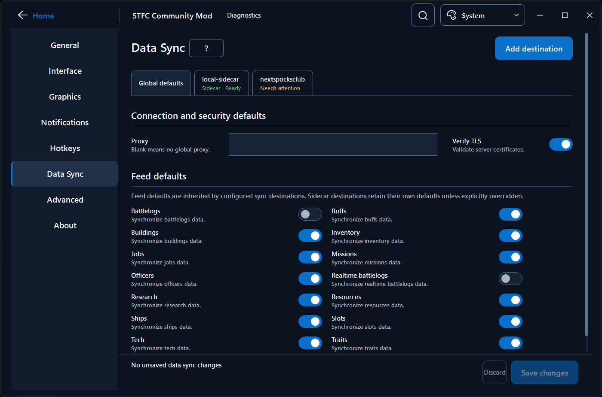
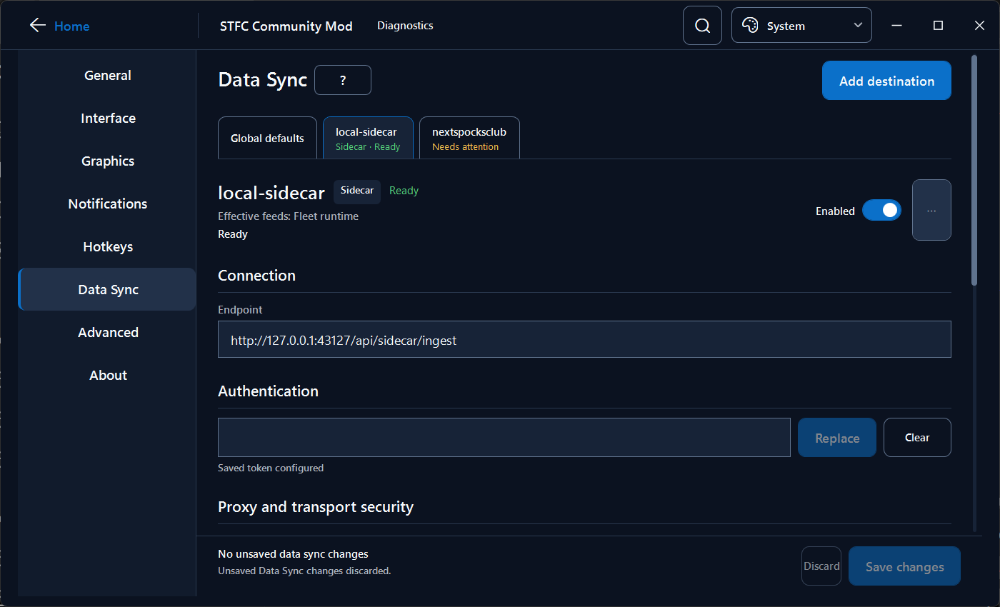
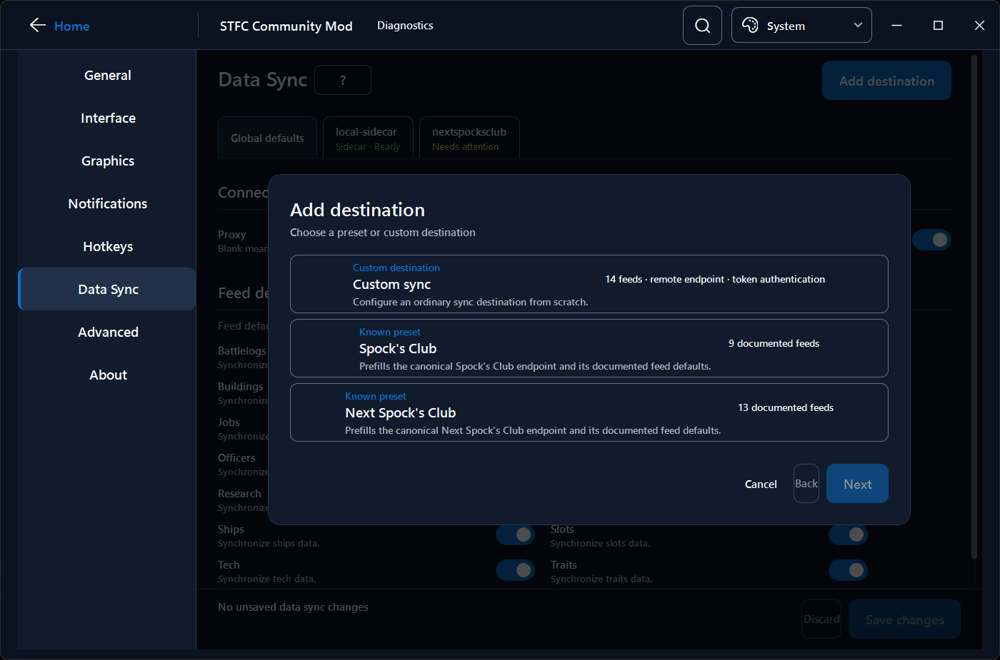
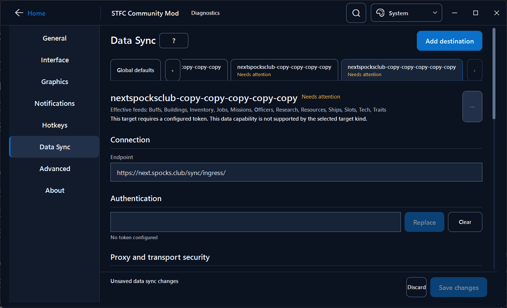
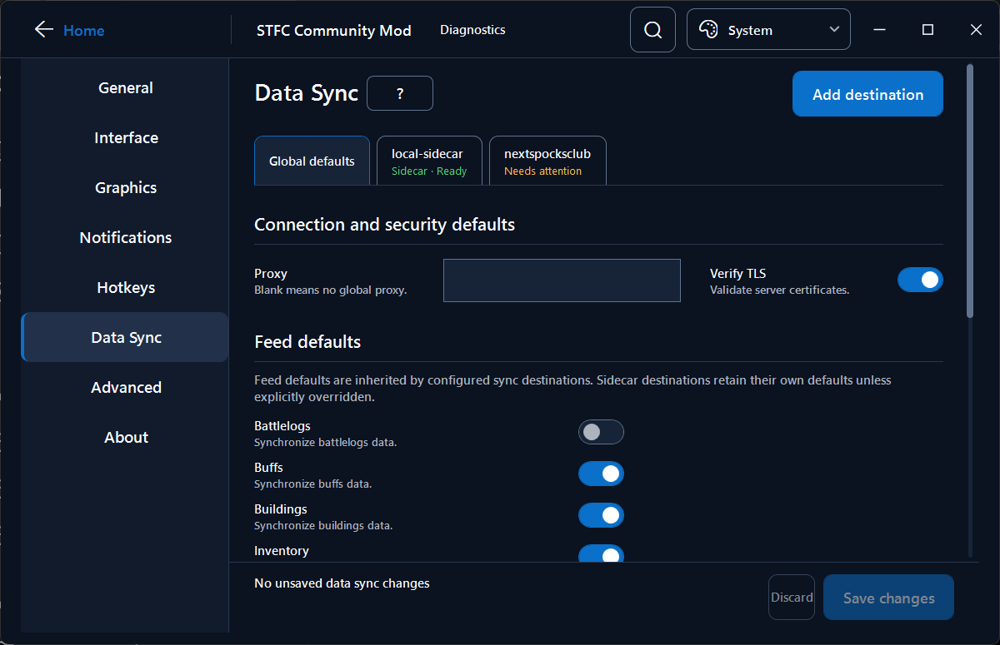

# Data Sync capability reference

This maintainer document records the Data Sync vocabulary and the capabilities established by the resolved
configuration catalog. It is not a runtime input; launcher behavior comes from `SyncTargetTypeCatalog`.

## Vocabulary and compatibility boundary

- **Sync** is the ordinary, user-creatable remote synchronization mechanism. Its persisted compatibility identifier
  remains `legacy`; that internal value is intentionally not exposed as product terminology.
- **Destination** is one configured Sync instance, identified by a stable TOML name such as `spocksclub`.
- **Provider preset** supplies known endpoint and feed defaults for an ordinary destination. It is not a transport or
  adapter type, and the staged destination remains editable.
- **Sidecar** is a distinct local integration. It is currently visible only when `[sidecar.sync]` already exists and
  is not offered by Add destination.
- **Majel** is an advanced TOML-only wrapper/mode around ordinary Sync. The launcher continues to parse and preserve
  it, but the normal Data Sync workspace does not create or display it.
- **Feed** (also called a package in older code and documentation) is one synchronized data category.

No persisted keys or mode values are migrated merely to align the UI vocabulary. The catalog translates compatibility
identifiers into the user-facing model.

## Discovery work log

The following matrix was derived from `SyncTargetTypeCatalog`, `SyncTopologyTomlAdapter`, the topology resolver, and
the established provider configurations before the corrected UI projection was implemented.

| Capability | Ordinary Sync (persisted `legacy`) | Sidecar | Majel advanced mode |
| --- | --- | --- | --- |
| Persistence | `[sync.targets.<name>]` | `[sidecar.sync]` | `[sync.targets.<name>]`, `mode = "majel"` |
| UI exposure | Creatable | Existing configuration only | Hidden; TOML only |
| Instances | Multiple named destinations | One, fixed identity `local-sidecar` | Multiple named destinations |
| Wire contract | `legacy_sync_json` | `sidecar_local_ingest` | `majel.ingest.v1` |
| Endpoint | Required; non-loopback | Required; loopback only; catalog supplies local default | Required; non-loopback |
| Authentication | Required opaque token | Required opaque token | Required opaque token |
| Proxy | Global / none / custom | Explicit target value; no global inheritance | Same persisted behavior as ordinary Sync |
| TLS | Inherits global verification and unsafe-TLS acknowledgement | Uses Sidecar defaults unless overridden | Same persisted behavior as ordinary Sync |
| Special fields | None established | Battle-log enrichment and fleet-runtime mode | No ordinary UI projection |

### Provider presets

Both established provider presets create ordinary Sync destinations. Tokens remain user-supplied and opaque.

| Preset | Suggested identity | Canonical endpoint | Documented feed settings |
| --- | --- | --- | --- |
| Spock's Club | `spocksclub` | `https://spocks.club/sync/ingress/` | 9 |
| Next Spock's Club | `spocksclub-next` | `https://next.spocks.club/sync/ingress/` | 13 |

The preset catalog records only settings established by the provider configuration. Omitted settings are **unknown**,
not presumed supported. The wizard does not offer them for that preset and stages them off so global defaults cannot
silently enable an undocumented feed. Changing the endpoint later turns the destination back into an ordinary custom
Sync destination with the full ordinary feed surface.

| Feed | Spock's Club default | Next Spock's Club default |
| --- | :---: | :---: |
| Battlelogs | Off | Off |
| Buffs | Unknown | On |
| Buildings | On | On |
| Inventory | Unknown | On |
| Jobs | Unknown | Off |
| Missions | Off | On |
| Officers | On | On |
| Research | On | On |
| Resources | On | On |
| Ships | Off | On |
| Slots | Unknown | On |
| Tech | Off | On |
| Traits | Off | On |
| Realtime battlelogs | Unknown | Unknown |

### Mechanism feed capabilities

| Feed | Ordinary Sync | Sidecar |
| --- | :---: | :---: |
| Battlelogs | Yes | — |
| Realtime battlelogs | Yes | Yes |
| Buffs | Yes | — |
| Buildings | Yes | — |
| Inventory | Yes | — |
| Jobs | Yes | — |
| Missions | Yes | — |
| Officers | Yes | — |
| Research | Yes | — |
| Resources | Yes | — |
| Ships | Yes | — |
| Slots | Yes | — |
| Tech | Yes | — |
| Traits | Yes | — |
| Fleet runtime | — | Yes |

Majel currently accepts the ordinary Sync feed keys in TOML, but this implementation detail is intentionally absent
from the normal UI.

## Inheritance and transaction behavior

Global defaults contain proxy, TLS verification, unsafe-TLS acknowledgement, and ordinary feed defaults. Ordinary
destinations inherit those values unless they record an explicit override. Sidecar resolves unset values from its own
defaults instead of global Sync defaults.

Boolean destination feed overrides have three states: **Global**, **On**, and **Off**. Proxy similarly distinguishes
**Use global**, **No proxy**, and **Custom proxy** where global inheritance is supported.

All Data Sync edits belong to one staged edit session. Additions, edits, duplication, removal, and global-default edits
are committed or discarded together. Saving changes the persisted topology; the running game continues using its
startup topology and must be restarted. Hidden Majel values and unknown fields remain in the document unless an owned
setting is explicitly changed.

## Meaningful limitations

- The launcher does not test network connectivity. No reusable application service currently exists for that scope.
- Saved tokens are never projected back into plaintext UI. Replacing or clearing one requires an explicit action.
- Sidecar cannot currently be created from the launcher.
- Majel is intentionally TOML-only and has no ordinary editor.
- No separate Community provider preset is exposed because its endpoint and provider-specific defaults are not
  established by the current implementation; Custom sync remains available.
- Changing the underlying sync mechanism is not exposed as a casual dropdown.
- The older root `sync.url`/`sync.token` representation requires explicit migration confirmation before edits can be
  persisted as a named destination.

## Destination-workspace implementation log

The launcher projects exposure policy, connection fields, feed capabilities, presets, endpoints, and preset defaults
from `SyncTargetTypeCatalog`. WPF does not infer behavior from destination or display names. Add destination projects
only `Creatable` catalog entries; existing Sidecar configuration projects through `ExistingConfigurationOnly`; Majel
remains loaded in the staged topology under `Hidden` so unrelated saves preserve it.

`SyncTopologyEditSession` owns one staged graph. Tabs select projections of that graph, so switching tabs cannot save
or discard. Wizard cancellation performs no topology transition; Finish stages one editable ordinary destination. The
production composition commits through `ConfigurationWorkspace.CommitSyncAsync`, retaining shared revision checks,
conflict detection, validation, backup, and the atomic document-write boundary.

The page has one styled vertical scrolling surface and a sticky transaction footer. The pinned Global tab sits outside
the internal destination strip. The strip exposes chevrons only on overflow, has no visible scrollbar, supports wheel
and trackpad movement plus Left/Right/Home/End navigation, and brings programmatic selection into view.

The supported application minimum is 960×620 logical pixels. Destination forms reflow without a page-level horizontal
scrollbar, primary actions remain reachable, and the wizard fits within the Data Sync surface.

### Standalone provider boundary

The standalone launcher resolves a provider-owned configuration catalog before it constructs Settings or Data Sync.
The catalog's stable source ID must exactly match the selected provider ID; an unknown capability, missing resource, or
identity mismatch disables both editors instead of projecting Guffawaffle capabilities onto another distribution.
The WPF Data Sync view then projects feed names and supported-feed sets from `SyncTargetTypeCatalog`; it does not carry
a second feed-capability map.

The provider-pack v1 contract does **not** contain an independently portable Data Sync catalog resource. The typed
catalog is projected from the selected provider's verified configuration catalog. Guffawaffle uses its generated
runtime contract; NetniV uses the exact reviewed release catalog selected from its versioned schema set. NetniV stable
`1.1.6.0` is currently established, while unreviewed versions and commits remain unknown and fail closed. Supporting any
later provider release still requires reviewed provider-specific configuration/sync evidence; the launcher must not
infer compatibility from TOML shape, a nearby branch, or display names.

### Visual validation

